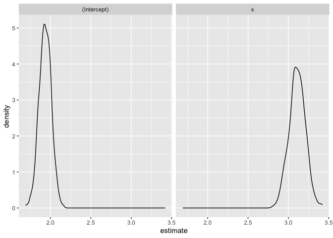

Bootstrapping
================
Xiaoyu Wu
2023-11-14

``` r
library(tidyverse)
```

    ## ── Attaching core tidyverse packages ──────────────────────── tidyverse 2.0.0 ──
    ## ✔ dplyr     1.1.3     ✔ readr     2.1.4
    ## ✔ forcats   1.0.0     ✔ stringr   1.5.0
    ## ✔ ggplot2   3.4.3     ✔ tibble    3.2.1
    ## ✔ lubridate 1.9.2     ✔ tidyr     1.3.0
    ## ✔ purrr     1.0.2     
    ## ── Conflicts ────────────────────────────────────────── tidyverse_conflicts() ──
    ## ✖ dplyr::filter() masks stats::filter()
    ## ✖ dplyr::lag()    masks stats::lag()
    ## ℹ Use the conflicted package (<http://conflicted.r-lib.org/>) to force all conflicts to become errors

``` r
library(p8105.datasets)
set.seed(1)
```

## Bootstrapping in SLR

``` r
n_samp = 250

sim_df_const = 
  tibble(
    x = rnorm(n_samp, 1, 1),
# will generate n_samp number of random values from a normal distribution with a mean of 1 and a standard deviation of 1
    error = rnorm(n_samp, 0, 1),
    y = 2 + 3 * x + error
  )
sim_df_nonconst = sim_df_const |> 
  mutate(
  error = error * .75 * x,
  y = 2 + 3 * x + error
)
```

Plot the datasets

``` r
sim_df_const |> 
  ggplot(aes(x=x,y=y))+
  geom_point()+
  geom_smooth(method="lm")
```

    ## `geom_smooth()` using formula = 'y ~ x'

<!-- -->

``` r
sim_df_nonconst |> 
  ggplot(aes(x=x,y=y))+
  geom_point()+
  geom_smooth(method="lm")
```

    ## `geom_smooth()` using formula = 'y ~ x'

<!-- -->

``` r
sim_df = 
  bind_rows(const = sim_df_const, nonconst = sim_df_nonconst, .id = "data_source") 
# creating a new variable "data_source" with const and nonconst 
```

``` r
sim_df |> 
  ggplot(aes(x = x, y = y)) + 
  geom_point(alpha = .5) +
  stat_smooth(method = "lm") +
  facet_grid(~data_source) 
```

    ## `geom_smooth()` using formula = 'y ~ x'

<!-- -->

``` r
lm(y ~ x, data = sim_df_const) |> 
  broom::tidy() |> 
  knitr::kable(digits = 3)
```

| term        | estimate | std.error | statistic | p.value |
|:------------|---------:|----------:|----------:|--------:|
| (Intercept) |    1.977 |     0.098 |    20.157 |       0 |
| x           |    3.045 |     0.070 |    43.537 |       0 |

``` r
lm(y ~ x, data = sim_df_nonconst) |> 
  broom::tidy() |> 
  knitr::kable(digits = 3)
```

| term        | estimate | std.error | statistic | p.value |
|:------------|---------:|----------:|----------:|--------:|
| (Intercept) |    1.934 |     0.105 |    18.456 |       0 |
| x           |    3.112 |     0.075 |    41.661 |       0 |

# Drawing one bootstrap sample

``` r
boot_sample = function(df) {
  sample_frac(df, replace = TRUE) |> 
    arrange(x)
}
```

Check if this works

``` r
boot_sample(sim_df_nonconst) |> 
  ggplot(aes(x = x, y = y)) + 
  geom_point(alpha = .3) +
  stat_smooth(method = "lm")
```

    ## `geom_smooth()` using formula = 'y ~ x'

<!-- -->

``` r
boot_sample(sim_df_nonconst) |> 
  (\(data) lm(y ~ x, data = data))() |> 
  broom::tidy()
```

    ## # A tibble: 2 × 5
    ##   term        estimate std.error statistic   p.value
    ##   <chr>          <dbl>     <dbl>     <dbl>     <dbl>
    ## 1 (Intercept)     1.90    0.0982      19.3 2.45e- 51
    ## 2 x               3.14    0.0688      45.6 1.18e-122

# Drawing many bootstrap samples

``` r
boot_straps = 
  tibble(strap_number = 1:1000,
          strap_sample = rerun(1000,boot_sample(sim_df_nonconst))) 
```

    ## Warning: `rerun()` was deprecated in purrr 1.0.0.
    ## ℹ Please use `map()` instead.
    ##   # Previously
    ##   rerun(1000, boot_sample(sim_df_nonconst))
    ## 
    ##   # Now
    ##   map(1:1000, ~ boot_sample(sim_df_nonconst))
    ## This warning is displayed once every 8 hours.
    ## Call `lifecycle::last_lifecycle_warnings()` to see where this warning was
    ## generated.

``` r
# This creates a tibble (a type of data frame in R) with one column named strap_number. The column contains numbers from 1 to 1000. Each number represents an individual bootstrap sample.
boot_straps
```

    ## # A tibble: 1,000 × 2
    ##    strap_number strap_sample      
    ##           <int> <list>            
    ##  1            1 <tibble [250 × 3]>
    ##  2            2 <tibble [250 × 3]>
    ##  3            3 <tibble [250 × 3]>
    ##  4            4 <tibble [250 × 3]>
    ##  5            5 <tibble [250 × 3]>
    ##  6            6 <tibble [250 × 3]>
    ##  7            7 <tibble [250 × 3]>
    ##  8            8 <tibble [250 × 3]>
    ##  9            9 <tibble [250 × 3]>
    ## 10           10 <tibble [250 × 3]>
    ## # ℹ 990 more rows

``` r
boot_straps |> 
  slice(1:3) |> 
  mutate(strap_sample = map(strap_sample, arrange, x)) |> 
  pull(strap_sample)
```

    ## [[1]]
    ## # A tibble: 250 × 3
    ##         x  error       y
    ##     <dbl>  <dbl>   <dbl>
    ##  1 -1.29   1.40  -0.454 
    ##  2 -0.989 -1.97  -2.93  
    ##  3 -0.914 -0.908 -1.65  
    ##  4 -0.914 -0.908 -1.65  
    ##  5 -0.805  0.292 -0.123 
    ##  6 -0.805  0.292 -0.123 
    ##  7 -0.665 -0.544 -0.539 
    ##  8 -0.641 -0.416 -0.338 
    ##  9 -0.606 -0.106  0.0774
    ## 10 -0.606 -0.106  0.0774
    ## # ℹ 240 more rows
    ## 
    ## [[2]]
    ## # A tibble: 250 × 3
    ##         x  error      y
    ##     <dbl>  <dbl>  <dbl>
    ##  1 -1.89   1.62  -2.04 
    ##  2 -1.89   1.62  -2.04 
    ##  3 -1.29   1.40  -0.454
    ##  4 -1.29   1.40  -0.454
    ##  5 -1.00   0.832 -0.169
    ##  6 -0.914 -0.908 -1.65 
    ##  7 -0.805  0.292 -0.123
    ##  8 -0.665 -0.544 -0.539
    ##  9 -0.665 -0.544 -0.539
    ## 10 -0.665 -0.544 -0.539
    ## # ℹ 240 more rows
    ## 
    ## [[3]]
    ## # A tibble: 250 × 3
    ##         x  error      y
    ##     <dbl>  <dbl>  <dbl>
    ##  1 -1.89   1.62  -2.04 
    ##  2 -1.89   1.62  -2.04 
    ##  3 -1.29   1.40  -0.454
    ##  4 -1.29   1.40  -0.454
    ##  5 -1.29   1.40  -0.454
    ##  6 -1.21  -0.781 -2.43 
    ##  7 -1.00   0.832 -0.169
    ##  8 -1.00   0.832 -0.169
    ##  9 -0.989 -1.97  -2.93 
    ## 10 -0.914 -0.908 -1.65 
    ## # ℹ 240 more rows

``` r
# This code takes the first three bootstrap samples from the boot_straps tibble, sorts each of these samples by the column x, and then extracts and returns these sorted samples.
```

``` r
boot_straps |> 
  slice(1:3) |> 
  unnest(strap_sample) |> 
  ggplot(aes(x = x, y = y)) + 
  geom_point(alpha = .5) +
  stat_smooth(method = "lm", se = FALSE) +
  facet_grid(~strap_number)
```

    ## `geom_smooth()` using formula = 'y ~ x'

<!-- -->

# Analyzing bootstrap samples

``` r
bootstrap_results = 
  boot_straps |> 
  mutate(
    models = map(strap_sample, ~ lm(y ~ x, data = .x) ),
    results = map(models, broom::tidy)) |> 
  select(-strap_sample, -models) |> 
  unnest(results) 

bootstrap_results |> 
  group_by(term) |> 
  summarize(mean_est=mean(estimate), 
    sd_est = sd(estimate)) |> 
  knitr::kable(digits = 3)
```

| term        | mean_est | sd_est |
|:------------|---------:|-------:|
| (Intercept) |    1.933 |  0.075 |
| x           |    3.109 |  0.101 |

Look at the distribution

``` r
bootstrap_results |> 
  ggplot(aes(x=estimate)) +
  geom_density()+
  facet_wrap(.~term)
```

<!-- -->
Construct a bootstrap confidence interval

``` r
bootstrap_results |> 
  group_by(term) |> 
  summarize(
    ci_lower = quantile(estimate, 0.025), 
#  It uses the quantile function to find the 2.5th percentile of the estimate column within each group.
    ci_upper = quantile(estimate, 0.975))
```

    ## # A tibble: 2 × 3
    ##   term        ci_lower ci_upper
    ##   <chr>          <dbl>    <dbl>
    ## 1 (Intercept)     1.79     2.08
    ## 2 x               2.91     3.31

``` r
# It finds the 97.5th percentile of the estimate column within each group.
```

``` r
boot_straps |> 
  unnest(strap_sample) |> 
  ggplot(aes(x = x, y = y)) + 
  geom_line(aes(group = strap_number), stat = "smooth", method = "lm", se = FALSE, alpha = .1, color = "blue") +
  geom_point(data = sim_df_nonconst, alpha = .5)
```

    ## `geom_smooth()` using formula = 'y ~ x'

<!-- -->

# bootstrap using modelr

``` r
boot_straps = 
  sim_df_nonconst |> 
  modelr::bootstrap(n = 1000,id="strap_number") |> 
  mutate(
    models = map(.x=strap, ~ lm(y ~ x, data = .x) ),
    results = map(models, broom::tidy)) |> 
  select(strap_number, results) |> 
  unnest(results) |> 
  group_by(term) |> 
  summarize(mean_est=mean(estimate), 
    sd_est = sd(estimate))
```

``` r
sim_df_nonconst |> 
  modelr::bootstrap(n = 1000) |> 
  mutate(
    models = map(strap, \(df) lm(y ~ x, data = df) ),
    results = map(models, broom::tidy)) |> 
  select(-strap, -models) |> 
  unnest(results) |> 
  group_by(term) |> 
  summarize(boot_se = sd(estimate))
```

    ## # A tibble: 2 × 2
    ##   term        boot_se
    ##   <chr>         <dbl>
    ## 1 (Intercept)  0.0793
    ## 2 x            0.104

``` r
sim_df_const |> 
  modelr::bootstrap(n = 1000) |> 
  mutate(
    models = map(strap, \(df) lm(y ~ x, data = df)),
    results = map(models, broom::tidy)) |> 
  select(-strap, -models) |> 
  unnest(results) |> 
  group_by(term) |> 
  summarize(boot_se = sd(estimate))
```

    ## # A tibble: 2 × 2
    ##   term        boot_se
    ##   <chr>         <dbl>
    ## 1 (Intercept)  0.101 
    ## 2 x            0.0735

# Airbnb data

``` r
data("nyc_airbnb")

nyc_airbnb = 
  nyc_airbnb |> 
  mutate(stars = review_scores_location / 2) |> 
  rename(
    borough = neighbourhood_group,
    neighborhood = neighbourhood) |> 
  filter(borough != "Staten Island") |> 
  drop_na(price, stars) |> 
  select(price, stars, borough, neighborhood, room_type)
```

``` r
nyc_airbnb |> 
  ggplot(aes(x = stars, y = price, color = room_type)) + 
  geom_point() 
```

<!-- -->

``` r
airbnb_boot_results=
  nyc_airbnb |> 
  filter(borough == "Manhattan") |> 
  drop_na(stars) |>
  modelr::bootstrap(n = 1000,id="strap_number") |> 
  mutate(
    models = map(.x=strap, ~lm(price ~ stars + room_type, data = .x)),
    results = map(models, broom::tidy)) |> 
  select(strap_number,results) |> 
  unnest(results) 

airbnb_boot_results |> 
  group_by(term) |> 
  summarize(
    mean_est=mean(estimate),
    sd_est=sd(estimate)
  )
```

    ## # A tibble: 4 × 3
    ##   term                  mean_est sd_est
    ##   <chr>                    <dbl>  <dbl>
    ## 1 (Intercept)               95.5  31.1 
    ## 2 room_typePrivate room   -124.    3.26
    ## 3 room_typeShared room    -154.    3.11
    ## 4 stars                     27.2   6.29

Compare this to `lm`

``` r
nyc_airbnb |> 
  filter(borough == "Manhattan") |> 
  drop_na(stars) |> 
  (\(data) lm(price ~ stars, data = data))() |> 
  broom::tidy()
```

    ## # A tibble: 2 × 5
    ##   term        estimate std.error statistic  p.value
    ##   <chr>          <dbl>     <dbl>     <dbl>    <dbl>
    ## 1 (Intercept)    -34.3     22.9      -1.50 1.35e- 1
    ## 2 stars           43.3      4.78      9.07 1.39e-19

``` r
airbnb_boot_results |> 
  filter(term=="stars") |> 
  ggplot(aes(x=estimate)) +
  geom_density()
```

<!-- -->
