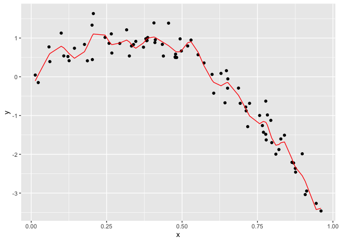

cross_validation
================
Xiaoyu Wu
2023-11-07

``` r
library(tidyverse)
```

    ## ── Attaching core tidyverse packages ──────────────────────── tidyverse 2.0.0 ──
    ## ✔ dplyr     1.1.3     ✔ readr     2.1.4
    ## ✔ forcats   1.0.0     ✔ stringr   1.5.0
    ## ✔ ggplot2   3.4.3     ✔ tibble    3.2.1
    ## ✔ lubridate 1.9.2     ✔ tidyr     1.3.0
    ## ✔ purrr     1.0.2     
    ## ── Conflicts ────────────────────────────────────────── tidyverse_conflicts() ──
    ## ✖ dplyr::filter() masks stats::filter()
    ## ✖ dplyr::lag()    masks stats::lag()
    ## ℹ Use the conflicted package (<http://conflicted.r-lib.org/>) to force all conflicts to become errors

``` r
library(modelr)
library(mgcv)
```

    ## Loading required package: nlme
    ## 
    ## Attaching package: 'nlme'
    ## 
    ## The following object is masked from 'package:dplyr':
    ## 
    ##     collapse
    ## 
    ## This is mgcv 1.9-0. For overview type 'help("mgcv-package")'.

``` r
set.seed(1)
```

## Simulate data

``` r
nonlin_df = 
  tibble(
    id = 1:100,
    x = runif(100, 0, 1),
    y = 1 - 10 * (x - .3) ^ 2 + rnorm(100, 0, .3)
  )
```

Look at data

``` r
nonlin_df %>% 
  ggplot(aes(x = x, y = y)) + 
  geom_point()
```

<!-- --> \##
Cross vadlidation “by hand” Get training and testing dataset

``` r
train_df = sample_n(nonlin_df, 80)
# train vs test should be 80 and 20 
test_df = anti_join(nonlin_df, train_df, by = "id")
# data in the nonlin_df but not in train_df

ggplot(train_df, aes(x = x, y = y)) + 
  geom_point() + 
  geom_point(data = test_df, color = "red")
```

<!-- --> Fit
three models.

``` r
linear_mod = lm(y ~ x, data = train_df)
smooth_mod = gam(y ~ s(x), data = train_df)
wiggly_mod = gam(y ~ s(x, k = 30), sp = 10e-6, data = train_df)
# k is the model complexity, and sp is smooth parameter 
```

Can I see what i just did …

``` r
train_df %>% 
  add_predictions(smooth_mod) %>% 
  ggplot(aes(x = x, y = y)) + geom_point() + 
  geom_line(aes(y = pred), color = "red")
```

<!-- -->

``` r
train_df %>% 
  add_predictions(wiggly_mod) %>% 
  ggplot(aes(x = x, y = y)) + geom_point() + 
  geom_line(aes(y = pred), color = "red")
```

<!-- -->

``` r
train_df %>% 
  gather_predictions(linear_mod, smooth_mod, wiggly_mod) %>% 
# gather predictions for multiple models 
  mutate(model = fct_inorder(model)) %>% 
  ggplot(aes(x = x, y = y)) + 
  geom_point() + 
  geom_line(aes(y = pred), color = "red") + 
  facet_wrap(~model)
```

<!-- -->
Look at prediction accuracy

``` r
rmse(linear_mod, test_df)
```

    ## [1] 0.7052956

``` r
rmse(smooth_mod, test_df)
```

    ## [1] 0.2221774

``` r
rmse(wiggly_mod, test_df)
```

    ## [1] 0.289051

## Cross validation using `modelr`

``` r
cv_df = 
  crossv_mc(nonlin_df, 100) 
# do 100 times CV 
```

What is happening here ..

``` r
cv_df %>% pull(train) %>% .[[1]] %>% as_tibble
```

    ## # A tibble: 79 × 3
    ##       id      x       y
    ##    <int>  <dbl>   <dbl>
    ##  1     1 0.266   1.11  
    ##  2     2 0.372   0.764 
    ##  3     3 0.573   0.358 
    ##  4     4 0.908  -3.04  
    ##  5     6 0.898  -1.99  
    ##  6     7 0.945  -3.27  
    ##  7     8 0.661  -0.615 
    ##  8     9 0.629   0.0878
    ##  9    10 0.0618  0.392 
    ## 10    11 0.206   1.63  
    ## # ℹ 69 more rows

``` r
cv_df %>% pull(test) %>% .[[1]] %>% as_tibble
```

    ## # A tibble: 21 × 3
    ##       id      x      y
    ##    <int>  <dbl>  <dbl>
    ##  1     5 0.202   1.33 
    ##  2    12 0.177   0.836
    ##  3    19 0.380   0.982
    ##  4    22 0.212   0.710
    ##  5    28 0.382   0.932
    ##  6    31 0.482   0.498
    ##  7    37 0.794  -1.12 
    ##  8    42 0.647   0.158
    ##  9    47 0.0233 -0.148
    ## 10    56 0.0995  1.13 
    ## # ℹ 11 more rows

``` r
cv_df =
  cv_df %>% 
  mutate(
    train = map(train, as_tibble),
    test = map(test, as_tibble))
```

``` r
cv_df=
  cv_df %>% 
  mutate(
    linear_mod  = map(.x=train, ~lm(y ~ x, data = .x)),
    smooth_mod  = map(.x=train, ~gam(y ~ s(x), data = .x)),
    wiggly_mod  = map(train, ~gam(y ~ s(x, k = 30), sp = 10e-6, data = .x))) %>% 
  mutate(
    rmse_linear = map2_dbl(.x=linear_mod, .y=test, ~rmse(model = .x, data = .y)),
    rmse_smooth = map2_dbl(.x=smooth_mod, .y=test, ~rmse(model = .x, data = .y)),
    rmse_wiggly = map2_dbl(.x=wiggly_mod,.y=test, ~rmse(model = .x, data = .y)))
```

``` r
 cv_df %>% 
  select(starts_with("rmse")) %>% 
  pivot_longer(
    everything(),
    names_to = "model", 
    values_to = "rmse",
    names_prefix = "rmse_") %>% 
  # get rid of the "rmse_" prefix 
  mutate(model = fct_inorder(model)) %>% 
  ggplot(aes(x = model, y = rmse)) + geom_violin()
```

<!-- -->
\## Example: Child Growth import my data:

``` r
child_growth = read_csv("./nepalese_children.csv")
```

    ## Rows: 2705 Columns: 5
    ## ── Column specification ────────────────────────────────────────────────────────
    ## Delimiter: ","
    ## dbl (5): age, sex, weight, height, armc
    ## 
    ## ℹ Use `spec()` to retrieve the full column specification for this data.
    ## ℹ Specify the column types or set `show_col_types = FALSE` to quiet this message.

weight vs arm circumference:

``` r
child_growth %>% 
  ggplot(aes(x = weight, y = armc)) + 
  geom_point(alpha = .5)
```

<!-- -->

``` r
child_growth =
  child_growth %>% 
  mutate(weight_cp = (weight > 7) * (weight - 7))
# set the change point at 7 
```

``` r
linear_mod = lm(armc ~ weight, data = child_growth)
pwl_mod    = lm(armc ~ weight + weight_cp, data = child_growth)
smooth_mod = gam(armc ~ s(weight), data = child_growth)
```

``` r
child_growth %>% 
  gather_predictions(linear_mod, pwl_mod, smooth_mod) %>% 
  mutate(model = fct_inorder(model)) %>% 
  ggplot(aes(x = weight, y = armc)) + 
  geom_point(alpha = .5) +
  geom_line(aes(y = pred), color = "red") + 
  facet_grid(~model)
```

<!-- -->

``` r
cv_df =
  crossv_mc(child_growth, 100) %>% 
  mutate(
    train = map(train, as_tibble),
    test = map(test, as_tibble))
```

``` r
cv_df = 
  cv_df %>% 
  mutate(
    linear_mod  = map(train, ~lm(armc ~ weight, data = .x)),
    pwl_mod     = map(train, ~lm(armc ~ weight + weight_cp, data = .x)),
    smooth_mod  = map(train, ~gam(armc ~ s(weight), data = as_tibble(.x)))) %>% 
  mutate(
    rmse_linear = map2_dbl(linear_mod, test, ~rmse(model = .x, data = .y)),
    rmse_pwl    = map2_dbl(pwl_mod, test, ~rmse(model = .x, data = .y)),
    rmse_smooth = map2_dbl(smooth_mod, test, ~rmse(model = .x, data = .y)))
```

``` r
cv_df %>% 
  select(starts_with("rmse")) %>% 
  pivot_longer(
    everything(),
    names_to = "model", 
    values_to = "rmse",
    names_prefix = "rmse_") %>% 
  mutate(model = fct_inorder(model)) %>% 
  ggplot(aes(x = model, y = rmse)) + geom_violin()
```

<!-- -->
